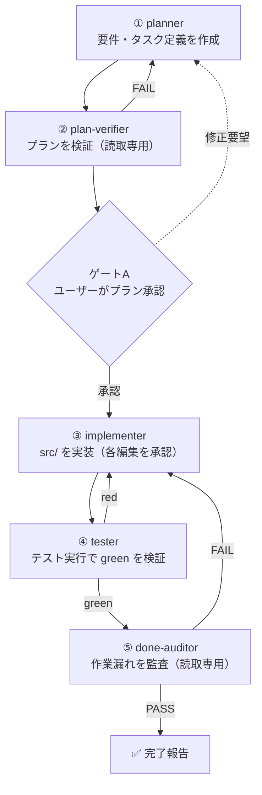

# multi-tenant-auth-api

**マルチテナント対応の認証認可 API を、AI エージェントの 5 段階パイプラインで開発したポートフォリオ。**


[](https://github.com/aki0057/multi-tenant-auth-api/actions/workflows/ci.yml)


---

## Overview

複数のテナントが同一システムを共有しつつ、ユーザーデータを **単一スキーマ内で分離** して管理する認証認可 API。アクセストークンとリフレッシュトークンによる認証フローを実装しており、トークンの取り扱いには次の設計判断を組み込んでいる。

- **リフレッシュトークンの秘匿** … 推測不能な不透明トークンとして発行し、DB には SHA-256 ハッシュのみを保存。使用のたびにローテーションする
- **Cookie の限定** … リフレッシュトークンは `HttpOnly / Secure / SameSite=Strict / Path=/auth/refresh` の Cookie でのみ受け渡しし、JavaScript からの窃取と他エンドポイントへの送信を防ぐ
- **CSRF 対策** … `/auth/refresh` は CSRF 保護を有効にし、`login` レスポンス時点で `XSRF-TOKEN` クッキーを先行発行して初回リフレッシュの鶏卵問題を回避する

本リポジトリの主眼は API そのものだけではない。**「実装を人手で書く」のではなく、役割の異なる AI エージェントを 5 段階のパイプラインでオーケストレーションし、要所にユーザー承認ゲートを挟んで開発を進める**、その開発プロセスの設計と実践をポートフォリオとして示すことにある。

- **開発プロセス** … 責務を分割した AI エージェントによる 5 段階パイプライン（本 README の主題）
- **成果物** … マルチテナント認証認可 API（DDD レイヤードアーキテクチャ）

---

## 開発プロセス：AI エージェント・オーケストレーション

### ねらい

一人の AI に実装を丸投げすると、計画・実装・検証・監査が渾然一体となり、レビューの効きどころが失われる。本プロジェクトでは工程を **計画 / 検証 / 実装 / テスト / 監査** に分解し、それぞれを **役割と権限を限定した専用サブエージェント**（Claude Code のサブエージェント機構）に担当させた。人間（メインセッション）は司令塔として各段階を駆動し、**プラン承認**と**各ファイル編集の承認**という 2 つのゲートで意思決定を握り続ける。

### パイプライン



### 各段階の役割

| # | エージェント          | 担当                                               | 権限                  |
|---|-----------------|--------------------------------------------------|---------------------|
| 1 | `planner`       | `.steering/` に requirements.md / tasklist.md を作成 | `.steering/` 配下のみ作成 |
| 2 | `plan-verifier` | プランがテンプレート・アーキテクチャ規約に適合するか検証                     | 読取専用                |
| 3 | `implementer`   | tasklist に従い `src/` を実装（Javadoc・正常系/異常系テスト含む）    | `src/` 配下（各編集を承認制）  |
| 4 | `tester`        | `./mvnw test` を実行し green を検証                     | テスト実行のみ             |
| 5 | `done-auditor`  | tasklist の充足・TODO.md への登録漏れを監査                   | 読取専用                |

### 状態の受け渡しと差し戻し

- **コールド起動 × steering ファイル** … 各サブエージェントはメインの文脈を引き継がない。作業状態は `.steering/<日時>-<作業内容>/` 配下のファイルが保持し、メインが各エージェントへ steering の絶対パスのみを渡す。
- **差し戻し** … 段階2が FAIL／ゲートAで修正要望 → 段階1へ。段階4が red → 段階3へ。段階5が FAIL → 段階3へ。各段階は前段階の完了を前提とし、手順の省略・順序変更を禁じる。

> パイプラインの詳細な契約は [`docs/file-change-workflow.md`](docs/file-change-workflow.md)、各エージェント定義は [`.claude/agents/`](.claude/agents/) を参照。

---

## アーキテクチャ

DDD レイヤードアーキテクチャを採用する。リクエストは外側から内側へ流れ、**ソースコードは必ず外側から内側へ向かって作成する**（外側は確定済み、内側はスタブとして新規作成）という制約をパイプラインの判断基準に組み込んでいる。

```
[外側] presentation   API / Controller
          ↓ 入力 DTO（Command）を渡す
        application    Service
          ↓
        domain         DomainObject / ValueObject / Repository
          ↓
[内側] infrastructure  persistence(mapper) / security
```

- **マルチテナント分離** … 単一スキーマ内でテナントごとにユーザーデータを分離。
- **ドメインモデルの徹底** … 業務レイヤーではプリミティブ型への依存を禁止し、ValueObject / DomainObject を用いる（境界の入力 DTO である Command のみ例外）。

---

## 技術スタック

| カテゴリ      | 技術                          |
|-----------|-----------------------------|
| Language  | Java 21                     |
| Framework | Spring Boot 3.5.14          |
| Security  | Spring Security / JJWT      |
| Database  | PostgreSQL                  |
| ORM       | Spring Data JPA             |
| Mapping   | MapStruct                   |
| API Docs  | springdoc / Swagger UI      |
| Build     | Maven                       |

---

## 実装状況

| エンドポイント   | 用途                                |  状態   |
|-----------|-----------------------------------|:-----:|
| `login`   | 認証しアクセス/リフレッシュトークンを発行             | ✅ 実装済 |
| `refresh` | Cookie のリフレッシュトークンで再発行（CSRF 保護あり） | ✅ 実装済 |
| `logout`  | セッション破棄                           | ✅ 実装済 |
| `user`    | 一般ユーザー向けリソース                      | ✅ 実装済 |
| `admin`   | 管理者向けリソース                         | ✅ 実装済 |

---

## セットアップと動作確認

### 1. 前提

- Java 21 / Docker

### 2. `.env` を用意する（Git 管理外）

```bash
cp .env.example .env
```

DB 接続情報・トークン有効期限は `.env.example` の値のままで動作する。`JWT_SECRET` と `SSL_KEYSTORE_PASSWORD` の 2 つだけ、以下の手順で生成した値に差し替える（コマンドはリポジトリルートで実行する）。

<details>
<summary>JWT 共通鍵と自己署名 PKCS12 証明書の生成手順</summary>

#### `JWT_SECRET`

以下の実行結果を `JWT_SECRET` に設定する。

```bash
openssl rand -base64 32
```

#### `SSL_KEYSTORE_PASSWORD`

自己署名 PKCS12 証明書を生成する。`-storepass` に指定した値を `SSL_KEYSTORE_PASSWORD` に設定する。

```bash
keytool -genkeypair \
  -alias localhost \
  -keyalg RSA -keysize 2048 -validity 365 \
  -storetype PKCS12 \
  -keystore keystore.p12 \
  -dname "CN=localhost" \
  -storepass samplepassword
```

</details>

### 3. 起動する

```bash
# DB
docker compose up -d

# アプリケーション
./mvnw spring-boot:run
```

### 4. Swagger UI で試す

自己署名証明書のためブラウザに警告が出るが、許可して続行する。

```
https://localhost:8443/swagger-ui/index.html
```

`login` リクエスト例:

```json
{
  "tenantCode": "testTenant",
  "email": "user1@example.com",
  "password": "password"
}
```

初期データとして次のユーザーが登録済み（パスワードは全ユーザー共通で `password`）:

| テナント | ユーザー |
|------|------|
| `testTenant` | user1 / user2 / admin10 |
| `demoTenant` | user1 / user3 / admin20 |

user1（`user1@example.com`）は両テナントに同一メールアドレスで登録されており、`UNIQUE(tenant_id, email)` による単一スキーマ内のテナント分離を確認できる。

`refresh` は、`login` 実行後にそのまま Try it out で実行すればよい。リフレッシュトークンは HttpOnly Cookie としてブラウザが自動送信し、CSRF 用の `X-XSRF-TOKEN` ヘッダも Swagger UI が自動付与する。

---

## ドキュメント

| ファイル | 内容 |
|------|------|
| [`docs/repository-structure.md`](docs/repository-structure.md) | ディレクトリ構成・ファイル配置ルール |
| [`docs/database-design.md`](docs/database-design.md) | ER 図・テーブル定義・共通カラム方針 |
| [`docs/file-change-workflow.md`](docs/file-change-workflow.md) | ファイル変更パイプライン・DDD アーキテクチャ |
| [`docs/testing-guidelines.md`](docs/testing-guidelines.md) | レイヤー別テスト方針・命名規則 |
| [`docs/git-conventions.md`](docs/git-conventions.md) | コミットメッセージ規約 |

---

## License

[MIT](LICENSE) © 2026 aki
