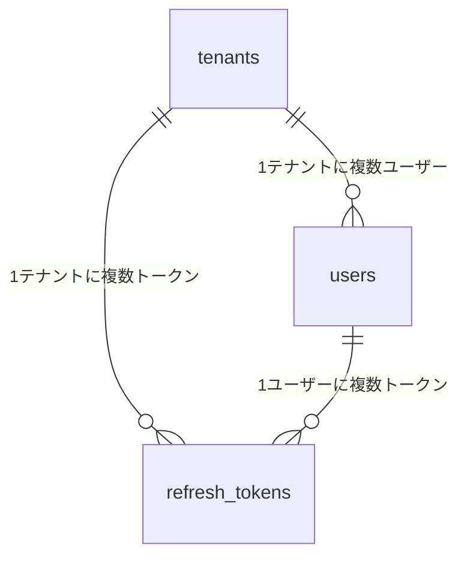

# データベース設計

## ER図

---

## テーブル一覧

| テーブル名            | 概要              |
|------------------|:----------------|
| `tenants`        | テナントマスター        |
| `users`          | ユーザー情報（テナントに所属） |
| `refresh_tokens` | リフレッシュトークン管理    |

---

## テーブル定義

> 共通カラム（`created_at` / `updated_at` / `created_by` / `updated_by`）は全テーブルに存在するが、表の見やすさのため省略する。  
> 詳細は「[共通カラム方針](#共通カラム方針)」を参照。

### tenants

| カラム名        | 型              | 制約                     | 備考           |
|-------------|----------------|------------------------|--------------|
| `id`        | `BIGSERIAL`    | PK                     |              |
| `code`      | `VARCHAR(50)`  | NOT NULL, UNIQUE       | テナント識別子      |
| `name`      | `VARCHAR(100)` | NOT NULL               | 表示用のテナント名    |
| `is_active` | `BOOLEAN`      | NOT NULL, DEFAULT TRUE | テナント有効/無効フラグ |

### users

| カラム名            | 型              | 制約                        | 備考                         |
|-----------------|----------------|---------------------------|----------------------------|
| `id`            | `BIGSERIAL`    | PK                        |                            |
| `tenant_id`     | `BIGINT`       | NOT NULL, FK → tenants.id |                            |
| `email`         | `VARCHAR(254)` | NOT NULL                  | テナント内で一意（複合UNIQUE）         |
| `password_hash` | `VARCHAR(255)` | NOT NULL                  | BCryptハッシュ                 |
| `role`          | `VARCHAR(20)`  | NOT NULL                  | `ROLE_ADMIN` / `ROLE_USER` |
| `is_active`     | `BOOLEAN`      | NOT NULL, DEFAULT TRUE    | アカウント有効/無効フラグ              |

- 複合UNIQUE制約：`(tenant_id, email)` — テナントをまたいだ同一メールアドレスは許可する

### refresh_tokens

| カラム名         | 型              | 制約                        | 備考                        |
|--------------|----------------|---------------------------|---------------------------|
| `id`         | `BIGSERIAL`    | PK                        |                           |
| `tenant_id`  | `BIGINT`       | NOT NULL, FK → tenants.id | テナント単位の一括無効化のために保持        |
| `user_id`    | `BIGINT`       | NOT NULL, FK → users.id   |                           |
| `token_hash` | `VARCHAR(255)` | NOT NULL, UNIQUE          | SHA-256ハッシュで保存（生トークンは非保存） |
| `expires_at` | `TIMESTAMPTZ`  | NOT NULL                  | トークン有効期限                  |
| `is_revoked` | `BOOLEAN`      | NOT NULL, DEFAULT FALSE   | ログアウト・ローテーション時に `TRUE` へ  |

#### `is_active` と `is_revoked` の使い分け

| 場面           | 操作                                                                                              |
|--------------|-------------------------------------------------------------------------------------------------|
| ユーザーが通常ログアウト | `refresh_tokens.is_revoked = TRUE`（アカウントは生きたまま）                                                 |
| トークンローテーション  | `refresh_tokens.is_revoked = TRUE`（旧トークンを廃棄）                                                    |
| ユーザーアカウント流出  | `users.is_active = FALSE` ＋ `UPDATE refresh_tokens SET is_revoked = TRUE WHERE user_id = ?`     |
| テナントアカウント流出  | `tenants.is_active = FALSE` ＋ `UPDATE refresh_tokens SET is_revoked = TRUE WHERE tenant_id = ?` |

緊急対応時に `refresh_tokens.tenant_id` を持つことで、JOINなしの単純な `WHERE tenant_id = ?` 1クエリで全トークンを無効化できる。

---

## 共通カラム方針

全テーブルに以下の管理用カラムを持たせる。Spring Data JPA の `@EntityListeners(AuditingEntityListener.class)` で自動管理する。

| カラム名         | 型                      | 管理                  |
|--------------|------------------------|---------------------|
| `created_at` | `TIMESTAMPTZ NOT NULL` | `@CreatedDate`      |
| `updated_at` | `TIMESTAMPTZ NOT NULL` | `@LastModifiedDate` |
| `created_by` | `VARCHAR NOT NULL`     | `@CreatedBy`        |
| `updated_by` | `VARCHAR NOT NULL`     | `@LastModifiedBy`   |
